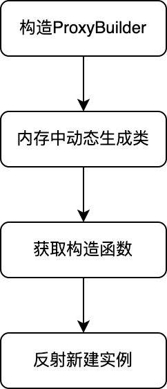
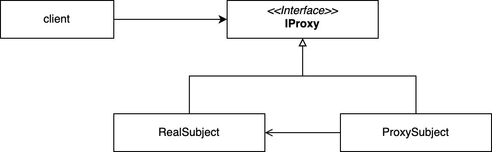
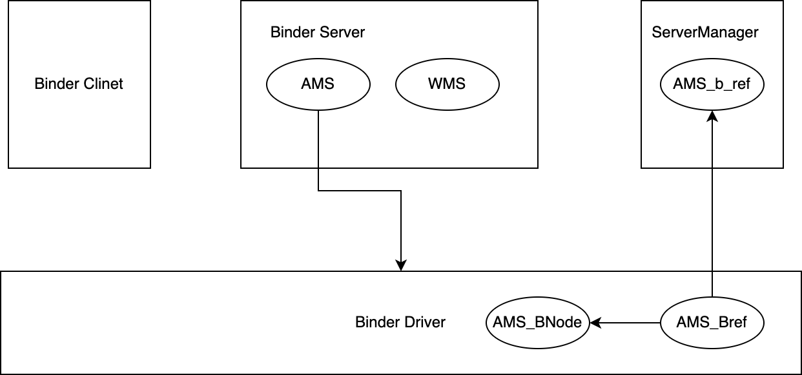

# java动态代理：
## 动态代理的简单使用
动态代理的使用非常简单，就是使用了proxy.newInstance去生成自己的代理类。例如我们有这么一个接口：
```java
public interface INetHelper {
    void get();

    void post();
}
```
使用动态代理生成：
```java
        INetHelper netHelper = (INetHelper) Proxy.newProxyInstance(INetHelper.class.getClassLoader(), new Class[]{INetHelper.class}, new InvocationHandler() {
            @Override
            public Object invoke(Object proxy, Method method, Object[] args) throws Throwable {
                if(method.getName().equals("post")){
                    System.out.println("执行post方法");
                }else if(method.getName().equals("get")){
                    System.out.println("执行get方法");
                }
                return null;
            }
        });
```
在执行netHelper.post和get方法的时候，就会打印出相关的信息。
## 动态代理的基本原理— 源码层面解析动态代理
###  动态代理流程概述
介绍完动态代理的前置知识，接下来针对整个动态代理流程做一个梳理。如图所示，描述了动态代理的大致流程 主要分为四个部分：ProxyBuilder构造、内存动态生成类、获取构造函数、反射获取实例，其中最重要的部分是内存动态生成类
</br></br>
</br>
### 构造ProxyBuilder
从动态代理的使用入手，调用Proxy.newProxyInstance生成实际类：
```java
    public static Object newProxyInstance(ClassLoader loader,Class<?>[] interfaces,InvocationHandler h) {
        Objects.requireNonNull(h);
        final Class<?> caller = System.getSecurityManager() == null? null: Reflection.getCallerClass();
        Constructor<?> cons = getProxyConstructor(caller, loader, interfaces);
        return newProxyInstance(caller, cons, h);
    }
```
System.getSecurityManager()这一部分和安全相关，可以不用管。这里实际上分成了两步：第一步是获取代理类对象的构造函数，通过getProxyConstructor获取，第二步就是通过构造函数生成代理类对象。</br>
接着来看getProxyConstructor():
```java
    private static Constructor<?> getProxyConstructor(Class<?> caller,ClassLoader loader,Class<?>... interfaces)
    {
        if (interfaces.length == 1) {
            Class<?> intf = interfaces[0];
            return proxyCache.sub(intf).computeIfAbsent(loader,
                (ld, clv) -> new ProxyBuilder(ld, clv.key()).build()
            );
        } else {
            final Class<?>[] intfsArray = interfaces.clone();
            final List<Class<?>> intfs = Arrays.asList(intfsArray);
            return proxyCache.sub(intfs).computeIfAbsent(loader,
                (ld, clv) -> new ProxyBuilder(ld, clv.key()).build()
            );
        }
    }
```
caller是安全相关，已经删去了无关代码。这里分了单接口和多接口的情况，但无论怎样，都是通过 proxyCache.sub(intfs).computeIfAbsent() 去返回代理类的构造函数：
```java
    public <K> Sub<K> sub(K key) {
        return new Sub<>(key);
    }
```
proxyCache.sub(intfs)实际上就是返回了一个Sub类。
```java
  Sub(K key){this.key=key;}
```
这个类在构造时将我们传递的接口保存起来。computeIfAbsent方法在Sub的父类AbstractClassLoaderValue里面：
```java
    public V computeIfAbsent(ClassLoader cl, BiFunction<? super ClassLoader,? super CLV,? extends V> mappingFunction) throws IllegalStateException {
        ConcurrentHashMap<CLV, Object> map = map(cl);
        CLV clv = (CLV) this;
        Memoizer<CLV, V> mv = null;
        while (true) {
            Object val = (mv == null) ? map.get(clv) : map.putIfAbsent(clv, mv);
            if (val == null) {
                if (mv == null) {
                    mv = new Memoizer<>(cl, clv, mappingFunction);
                    continue;
                }
                try {
                    V v = mv.get();
                    map.replace(clv, mv, v);
                    return v;
                } catch (Throwable t) {
                    map.remove(clv, mv);
                    throw t;
                }
            } else {
                try {
                    return extractValue(val);
                } catch (Memoizer.RecursiveInvocationException e) {
                    throw e;
                } catch (Throwable t) {
                }
            }
        }
    }
```
clv就是sub自身，V就指代构造函数。因此是通过mv.get()方法构造的。而mv又是通过classloader、sub、传递进来的函数接口即(ld, clv) -> new ProxyBuilder(ld, clv.key()).build()共同构造的。接下来看一下mv.get()：
```java
        public V get() throws RecursiveInvocationException {
            V v = this.v;
            if (v != null) return v;
            Throwable t = this.t;
            if (t == null) {
                synchronized (this) {
                    if ((v = this.v) == null && (t = this.t) == null) {
                        if (inCall) {
                            throw new RecursiveInvocationException();
                        }
                        inCall = true;
                        try {
                            this.v = v = Objects.requireNonNull(
                                mappingFunction.apply(cl, clv));
                        } catch (Throwable x) {
                            this.t = t = x;
                        } finally {
                            inCall = false;
                        }
                    }
                }
            }
            if (v != null) return v;
            if (t instanceof Error) {
                throw (Error) t;
            } else if (t instanceof RuntimeException) {
                throw (RuntimeException) t;
            } else {
                throw new UndeclaredThrowableException(t);
            }
        }
```
这里就很简单明了了，实际上是通过调用mappingFunction的apply方法构造的构造函数。即前面函数式编程传入的：
```java
            return proxyCache.sub(intf).computeIfAbsent(loader,
                (ld, clv) -> new ProxyBuilder(ld, clv.key()).build()
            );
```
ld就是classloader，clv就是sub，sub.key()就是我们的Interfaces列表或者单个interface。通过new ProxyBuilder().build()构造出代理类，并且获得构造函数

### 内存动态生成类
内存动态生成类的主要逻辑，在ProxyBuilder.build()内部。
```java
        Constructor<?> build() {
            Class<?> proxyClass = defineProxyClass(module, interfaces);
            final Constructor<?> cons;
            try {
                cons = proxyClass.getConstructor(constructorParams);
            } catch (NoSuchMethodException e) {
                throw new InternalError(e.toString(), e);
            }
            return cons;
        }
```
这里分为两步：1. 调用defineProxyClass生成动态代理类  2. 使用getConstructor获取构造函数
```java
        private static Class<?> defineProxyClass(Module m, List<Class<?>> interfaces) {
            String proxyPkg = null;     // package to define proxy class in
            int accessFlags = Modifier.PUBLIC | Modifier.FINAL;
        /**
         * 第一步，校验各个interface是否在同一个包下
         */
        for (Class<?> intf : interfaces) {
                int flags = intf.getModifiers();
                if (!Modifier.isPublic(flags)) {
                    accessFlags = Modifier.FINAL;  // non-public, final
                    String pkg = intf.getPackageName();
                    if (proxyPkg == null) {
                        proxyPkg = pkg;
                    } else if (!pkg.equals(proxyPkg)) {
                        throw new IllegalArgumentException(
                                "non-public interfaces from different packages");
                    }
                }
            }
        /**
         * 包名
         */
            if (proxyPkg == null) {
                // all proxy interfaces are public
                proxyPkg = m.isNamed() ? PROXY_PACKAGE_PREFIX + "." + m.getName()
                                       : PROXY_PACKAGE_PREFIX;
            } else if (proxyPkg.isEmpty() && m.isNamed()) {
                throw new IllegalArgumentException(
                        "Unnamed package cannot be added to " + m);
            }

            if (m.isNamed()) {
                if (!m.getDescriptor().packages().contains(proxyPkg)) {
                    throw new InternalError(proxyPkg + " not exist in " + m.getName());
                }
            }

        /**
         * 确认代理类名
         */
        long num = nextUniqueNumber.getAndIncrement();
            String proxyName = proxyPkg.isEmpty()
                                    ? proxyClassNamePrefix + num
                                    : proxyPkg + "." + proxyClassNamePrefix + num;

            ClassLoader loader = getLoader(m);
            trace(proxyName, m, loader, interfaces);
            byte[] proxyClassFile = ProxyGenerator.generateProxyClass(
                    proxyName, interfaces.toArray(EMPTY_CLASS_ARRAY), accessFlags);
        /**
         * 生成类
         */
        try {
                Class<?> pc = UNSAFE.defineClass(proxyName, proxyClassFile,
                                                 0, proxyClassFile.length,
                                                 loader, null);
                reverseProxyCache.sub(pc).putIfAbsent(loader, Boolean.TRUE);
                return pc;
            } catch (ClassFormatError e) {
                throw new IllegalArgumentException(e.toString());
            }
        }
```
这里首先做了一些前期校验的工作，然后确认包名，如果模块未命名，则使用默认的PROXY_PACKAGE_PREFIX，即com.sun.proxy作为包名。紧接着确认类名：
proxyPkg + "." + proxyClassNamePrefix + num，即com.sun.proxy + "." + "$Proxy" + 次序。生成一个代理类，num就会增加。所以实际上的类名会类似于：com.sun.proxy.$Proxy1这样。接下来就是重头戏了，在内存中是如何对类进行生成的,首先通过ProxyGenerator.generateProxyClass生成二进制文件
```java
    static byte[] generateProxyClass(final String name,
        Class<?>[] interfaces,
        int accessFlags)
        {
        ProxyGenerator gen = new ProxyGenerator(name, interfaces, accessFlags);
final byte[] classFile = gen.generateClassFile();

        if (saveGeneratedFiles) {
        java.security.AccessController.doPrivileged(
        new java.security.PrivilegedAction<Void>() { public Void run() {
        try {
        int i = name.lastIndexOf('.');
        Path path;
        if (i > 0) {
        Path dir = Path.of(name.substring(0, i).replace('.', File.separatorChar));
        Files.createDirectories(dir);
        path = dir.resolve(name.substring(i+1, name.length()) + ".class");
        } else {
        path = Path.of(name + ".class");
        }
        Files.write(path, classFile);
        return null;
        } catch (IOException e) {
        throw new InternalError(
        "I/O exception saving generated file: " + e);
        }
        }
        });
        }

        return classFile;
        }
```
这里是通过ProxyGenerator生成class文件，注意这里有一个saveGeneratedFiles,如果为true的话，就会保存生成的类，写入文件里。在我们日常调试的时候，可以设置这个值为true。
```java
    private static final boolean saveGeneratedFiles =
        java.security.AccessController.doPrivileged(
            new GetBooleanAction(
                "jdk.proxy.ProxyGenerator.saveGeneratedFiles")).booleanValue();
```
只需要通过System.setProperty("jdk.proxy.ProxyGenerator.saveGeneratedFiles","true"); 就可以看到我们生成的代理类了</br>
接着继续看类的生成
```java
   private byte[] generateClassFile() {

        /* ============================================================
         * Step 1: Assemble ProxyMethod objects for all methods to
         * generate proxy dispatching code for.
         */

        /*
         * Record that proxy methods are needed for the hashCode, equals,
         * and toString methods of java.lang.Object.  This is done before
         * the methods from the proxy interfaces so that the methods from
         * java.lang.Object take precedence over duplicate methods in the
         * proxy interfaces.
         */
        addProxyMethod(hashCodeMethod, Object.class);
        addProxyMethod(equalsMethod, Object.class);
        addProxyMethod(toStringMethod, Object.class);

        /*
         * Now record all of the methods from the proxy interfaces, giving
         * earlier interfaces precedence over later ones with duplicate
         * methods.
         */
        for (Class<?> intf : interfaces) {
            for (Method m : intf.getMethods()) {
                if (!Modifier.isStatic(m.getModifiers())) {
                    addProxyMethod(m, intf);
                }
            }
        }

        /*
         * For each set of proxy methods with the same signature,
         * verify that the methods' return types are compatible.
         */
        for (List<ProxyMethod> sigmethods : proxyMethods.values()) {
            checkReturnTypes(sigmethods);
        }

        /* ============================================================
         * Step 2: Assemble FieldInfo and MethodInfo structs for all of
         * fields and methods in the class we are generating.
         */
        try {
            methods.add(generateConstructor());

            for (List<ProxyMethod> sigmethods : proxyMethods.values()) {
                for (ProxyMethod pm : sigmethods) {

                    // add static field for method's Method object
                    fields.add(new FieldInfo(pm.methodFieldName,
                        "Ljava/lang/reflect/Method;",
                         ACC_PRIVATE | ACC_STATIC));

                    // generate code for proxy method and add it
                    methods.add(pm.generateMethod());
                }
            }

            methods.add(generateStaticInitializer());

        } catch (IOException e) {
            throw new InternalError("unexpected I/O Exception", e);
        }

        if (methods.size() > 65535) {
            throw new IllegalArgumentException("method limit exceeded");
        }
        if (fields.size() > 65535) {
            throw new IllegalArgumentException("field limit exceeded");
        }

        /* ============================================================
         * Step 3: Write the final class file.
         */

        /*
         * Make sure that constant pool indexes are reserved for the
         * following items before starting to write the final class file.
         */
        cp.getClass(dotToSlash(className));
        cp.getClass(superclassName);
        for (Class<?> intf: interfaces) {
            cp.getClass(dotToSlash(intf.getName()));
        }

        /*
         * Disallow new constant pool additions beyond this point, since
         * we are about to write the final constant pool table.
         */
        cp.setReadOnly();

        ByteArrayOutputStream bout = new ByteArrayOutputStream();
        DataOutputStream dout = new DataOutputStream(bout);

        try {
            /*
             * Write all the items of the "ClassFile" structure.
             * See JVMS section 4.1.
             */
                                        // u4 magic;
            dout.writeInt(0xCAFEBABE);
                                        // u2 minor_version;
            dout.writeShort(CLASSFILE_MINOR_VERSION);
                                        // u2 major_version;
            dout.writeShort(CLASSFILE_MAJOR_VERSION);

            cp.write(dout);             // (write constant pool)

                                        // u2 access_flags;
            dout.writeShort(accessFlags);
                                        // u2 this_class;
            dout.writeShort(cp.getClass(dotToSlash(className)));
                                        // u2 super_class;
            dout.writeShort(cp.getClass(superclassName));

                                        // u2 interfaces_count;
            dout.writeShort(interfaces.length);
                                        // u2 interfaces[interfaces_count];
            for (Class<?> intf : interfaces) {
                dout.writeShort(cp.getClass(
                    dotToSlash(intf.getName())));
            }

                                        // u2 fields_count;
            dout.writeShort(fields.size());
                                        // field_info fields[fields_count];
            for (FieldInfo f : fields) {
                f.write(dout);
            }

                                        // u2 methods_count;
            dout.writeShort(methods.size());
                                        // method_info methods[methods_count];
            for (MethodInfo m : methods) {
                m.write(dout);
            }

                                         // u2 attributes_count;
            dout.writeShort(0); // (no ClassFile attributes for proxy classes)

        } catch (IOException e) {
            throw new InternalError("unexpected I/O Exception", e);
        }

        return bout.toByteArray();
    }
```
类的生成分为这么几步：</br>
1. 添加hashcode、equals、toString方法
2. 添加接口列表中的所有非静态方法
3. 将类的一些基本信息，如魔数、java版本写入
4. 写入1、2步添加的方法</br>

关于写入，就是写入字节码相关的东西，因为这一部分比较庞大，就不展开说了。因此这里可以知道的是，实际上在动态代理的过程中，在内存中生成了字节码。因此动态代理实际上对于性能，是存在一定的影响的。
例如Android中的Retrofit，使用动态代理实现自己的功能，当网络的api非常多的时候，会带来不小的内存损耗

## 代理模式
### 代理模式基础知识
代理模式的定义：为其他对象提供一个代理对象，以控制这个对象的访问</br>
当其他对象直接访问存在困难时，可以通过中间代理实现对这个对象访问或者控制。</br>
如下是代理模式的UML图：</br>
</br>
</br>
代理类ProxySubject和真实对象RealSubject实现同一个接口，也就是说，二者对外暴露的功能是一样的。客户端不直接访问RealSubject,而是通过ProxySubject访问。ProxySubject的内在逻辑通过RealSubject去实现。</br>
用代码来描述，有这样一个接口：
```java
public interface IProxy {
    void doSomething();
}
```
被代理类RealProxy;
```java
public class RealProxy  implements IProxy{
    @Override
    public void doSomething() {
        System.out.println("do real something");
    }
}
```
代理类ProxySubject:
```java
public class ProxySubject implements IProxy {
    IProxy proxy = new RealProxy();

    public ProxySubject(IProxy proxy) {
        this.proxy = proxy;
    }

    public ProxySubject() {
    }

    @Override
    public void doSomething() {
        proxy.doSomething();
    }
}
```
这里ProxySubject就是对RealProxy的代理，客户端通过ProxySubject实现对RealProxy的访问
### 静态代理与动态代理
上文所举的例子，就是代理模式的一种：静态代理。一个固定的接口，由代理类和被代理类去实现，代理类负责访问控制。这种情况下属于静态代理。也就是说，接口是定死的。当然多个接口也可以实现，只需要代理类去实现所有的接口即可。这些情况都符合一个共同的特点：接口是定死的，不是未知的，不能够参数化。
java的动态代理就是为了解决这个问题。接受参数化的接口列表，然后通过这些列表动态生成代理类。在invoke方法中通过方法名等执行不同的逻辑。</br>
但实际上，其方法的具体实现方式是和静态代理一样的。我们来看一下上文中生成的INetHelper的代理类：
```java
public final class $Proxy0 extends Proxy implements INetHelper {
    private static Method m1;
    private static Method m3;
    private static Method m2;
    private static Method m4;
    private static Method m0;

    public $Proxy0(InvocationHandler var1) throws  {
        super(var1);
    }

    public final boolean equals(Object var1) throws  {
        try {
            return (Boolean)super.h.invoke(this, m1, new Object[]{var1});
        } catch (RuntimeException | Error var3) {
            throw var3;
        } catch (Throwable var4) {
            throw new UndeclaredThrowableException(var4);
        }
    }

    public final void post() throws  {
        try {
            super.h.invoke(this, m3, (Object[])null);
        } catch (RuntimeException | Error var2) {
            throw var2;
        } catch (Throwable var3) {
            throw new UndeclaredThrowableException(var3);
        }
    }

    public final String toString() throws  {
        try {
            return (String)super.h.invoke(this, m2, (Object[])null);
        } catch (RuntimeException | Error var2) {
            throw var2;
        } catch (Throwable var3) {
            throw new UndeclaredThrowableException(var3);
        }
    }

    public final void get() throws  {
        try {
            super.h.invoke(this, m4, (Object[])null);
        } catch (RuntimeException | Error var2) {
            throw var2;
        } catch (Throwable var3) {
            throw new UndeclaredThrowableException(var3);
        }
    }

    public final int hashCode() throws  {
        try {
            return (Integer)super.h.invoke(this, m0, (Object[])null);
        } catch (RuntimeException | Error var2) {
            throw var2;
        } catch (Throwable var3) {
            throw new UndeclaredThrowableException(var3);
        }
    }

    static {
        try {
            m1 = Class.forName("java.lang.Object").getMethod("equals", Class.forName("java.lang.Object"));
            m3 = Class.forName("INetHelper").getMethod("post");
            m2 = Class.forName("java.lang.Object").getMethod("toString");
            m4 = Class.forName("INetHelper").getMethod("get");
            m0 = Class.forName("java.lang.Object").getMethod("hashCode");
        } catch (NoSuchMethodException var2) {
            throw new NoSuchMethodError(var2.getMessage());
        } catch (ClassNotFoundException var3) {
            throw new NoClassDefFoundError(var3.getMessage());
        }
    }
}
```
这里就佷清晰明了了。实际上动态代理也是通过invokeHandler去实现的。本质上，静态代理和动态代理的区别还是在支持多个接口参数化的问题上有所区分
## 代理模式的应用
说到这里其实大伙们可能会有一些疑问：代理模式我确实清楚了，但是实际使用怎么用呢？如何用到项目中去呢？纸上空谈，总是不能够深刻理解。因此我们对代理模式的应用做一个简单的举例</br>
代理模式的应用纬度上，可以分为四类：
1. 远程代理
2. 虚拟代理
3. 智能引用
4. 保护代理

远程代理很好理解，如果一个对象在远程服务器上，那么客户端是不能直接访问的，要通过代理去访问。比如在Android中涉及跨进程通信时，会使用Binder机制进行通信。Binder会生成一个代理对象给客户端。客户端通过这个代理对象实现对别的进程的访问</br>
虚拟代理是指，在使用一些消耗资源较大的对象时，延迟初始化。比如有一个对象，创建他消耗的资源比较多，我们在进行代理时，用到才会初始化
智能引用其实就是除了使用被代理类的功能，还加上一些新的功能。类似于装饰器模式
保护代理实际上就是因为某种原因无法直接访问，从而使用代理模式。Android中的Binder跨进程通信就是这个机制。在下文会进行一个简要的阐述

## Binder跨进程通信机制简要分析
这里对Binder机制做一个简要的阐述，不会深入源码级别，只是对整个流程上进行一个梳理</br>
Binder机制可以分为4个大块：
1. BinderClient 跨进程通信请求方
2. BinderServer 服务方，例如AMS、WMS
3. ServerManager,类似于DNS服务器，寻址binderServer的代理
4. BinderDriver，Linux内核层关于Binder跨进程通信的驱动


Binder server在生成一个服务实体的时候，例如AMS,会在BinderDriver中生成一个Binder节点AMS_BNode。这个Binder节点在生成的时候还会生成一个Binder引用，并在serverManager中进行注册。serverManager中通过<服务名，B_REF>来记录引用的保存。当客户端访问AMS时，会先访问ServerManager，将ams的名字交给ServerManager，ServerManager返回B_REF
交给clinet,clinet通过这个引用访问BNode，再通过BinderDriver 的mmap实现跨进程的通信。</br>
这里其实可以看到，ServerManager返回的引用，就类似于一个代理类。通过这个代理类，可以做到跨进程的通信。这里其实Android中通过aidl来进行描述这样一种通信，我们常用的也有IActivityManager等。代理节点本身也使用了一种代理模式的思想：在公共的空间，建立一个中转站，承上启下。上通BinderServer，下通BinderClient。这就是保护代理的精髓。

